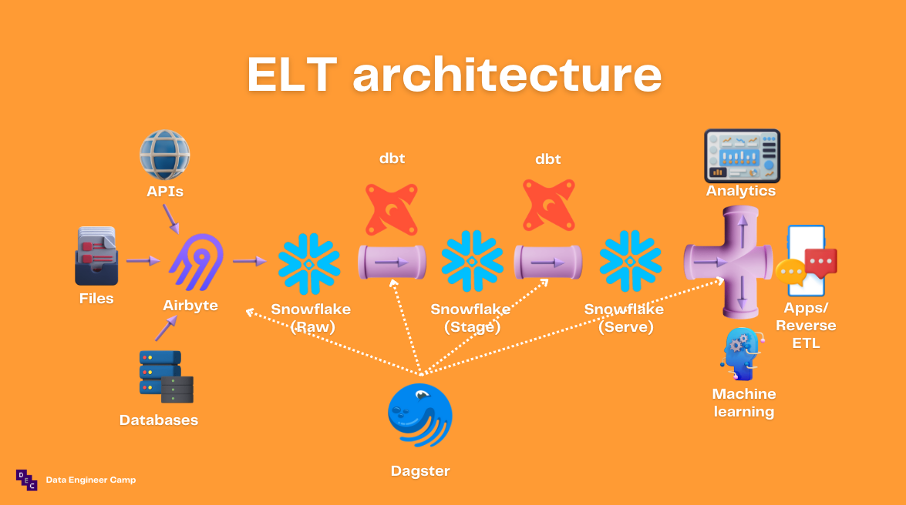

# Medicare Prescription Data ELT
# test test test 


## Introduction 

This is a demo project to create an ELT pipeline using airbyte, dbt, snowflake and dagster. 



- [airbyte](https://docs.airbyte.com/)
- [dbt](https://docs.getdbt.com/docs/introduction)
- [dagster](https://docs.dagster.io/getting-started)
- [snowflake](https://docs.snowflake.com/en/)

Accompanying presentation [here](https://bit.ly/dataengineercamp-modern-elt-demo)

## Getting started 

1. Create a new snowflake account [here](https://signup.snowflake.com/)

2. Run the SQL code [snowflake_airbyte_setup.sql](integration/destination/snowflake_airbyte_setup.sql) to configure an Airbyte account in Snowflake 

3. Export the following environment variables 

    ```
    export AIRBYTE_PASSWORD=your_snowflake_password_for_airbyte_account
    export SNOWFLAKE_ACCOUNT_ID=your_snowflake_password
    ```

4. Install the python dependencies

    ```
    pip install -r requirements.txt
    ```

5. Create the mock source database by: 
    - Install [postgresql](https://www.postgresql.org/)
    - Create a new database in your localhost called `dvdrental` 
    - Unzip [dvdrental.zip](integration/source/dvdrental.zip)
    - Use PgAdmin4 to [restore dvdrental](https://www.pgadmin.org/docs/pgadmin4/development/restore_dialog.html)

## Using airbyte 

1. Create a source for the postgresql database `dvdrental`
    - host: `host.docker.internal`
2. Create a destination for the Snowflake database 
3. Create a connection between `dvdrental` and `snowflake` 
    - Namespace Custom Format: `<your_destination_schema>`
4. Run the sync job 

## Using snowflake 

1. Log in to your snowflake account 
2. Go to `worksheets` > `+ worksheet` 
3. On the top right, select the role `ACCOUNTADMIN.AIRBYTE_WAREHOUSE`. 
4. On the top left of the worksheet, select `AIRBYTE_DATABASE.AIRBYTE_SCHEMA` 
5. Query one of the synced tables from airbyte e.g. `select * from customer` 

## Using dbt 

1. `cd` to `transform/dw` 
2. Execute the command `dbt docs generate` and `dbt docs serve` to create the dbt docs and view the lineage graph 
3. Execute the command `dbt build` to run and test dbt models 

## Using dagster 
1. `cd` to `orchestrate/elt` 
2. Execute the command `dagit` to launch the dagit user interface 
3. Go to `workspace` > `jobs` > `elt_job` > `launchpad` > `launch run` to launch the run
